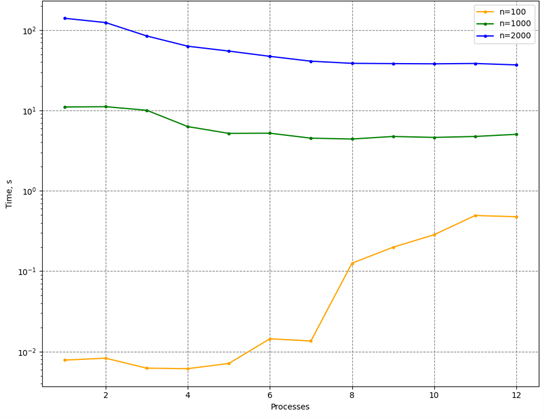
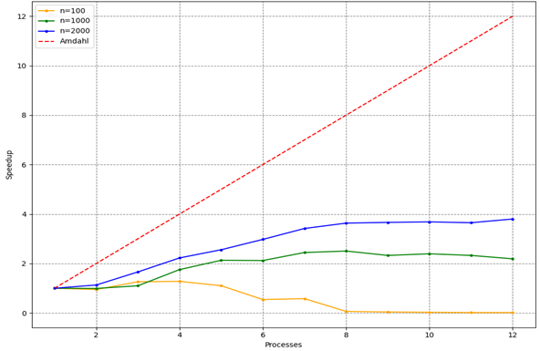

# Task H (MPI)

Write a program to evaluate a matrix expression:

$A = Tr(BC^3)E+Tr'(B)I$,

where $B,C$ are square dense matrices, the elements of which are of the **double** type, $I$ is the identity matrix, $Tr(M)$ is the trace of the matrix $M$, $Tr'(M)$ is the "antitrace" of the matrix $M$ (the sum of the elements of the antidiagonal). Parallelize this program using MPI. Study the dependence of the scalability of a parallel version of a program on its computational complexity (matrix size). Check if the parallel version is correct.

Verification of Amdahl's Law. Build a dependency *speedup:number of threads* for a given example.

## Prerequisites
- `CMake 3.5+`
- `some C++11 compiler`
- `MPI` (`mpiexec` must be in environment)

## Usage
### Configure
In project root:
```console
usr:~/02.MPI$ mkdir build
usr:~/02.MPI$ cd build
usr:~/02.MPI/build$ cmake ..
```
### Build
```console
usr:~/02.MPI/build$ cmake --build .
```
### Run example
```console
usr:~/02.MPI/build$ mpiexec -n 4 ./HPC_02_MPI
```
`-n 4` - number of processes
### Run tests
```console
usr:~/02.MPI/build$ ctest
```
### Run benchmarks
```console
usr:~/02.MPI/build$ ../benchmarks/benchmarks.sh
```
You can pass the path to `HPC_02_benchmark` (default is *"./HPC_02_benchmark"*)


## Performance

Software & hardware configuration:

| | |
| --- | --- |
OS | Ubuntu 22.04.2 LTS |
Cores | 6 |
Threads |	12 |
Processor model |	Intel(R) Xeon(R) E-2136 CPU @ 3.30GHz |
RAM | 64GiB |
Compiler | g++ (GCC) 10.2.0 |
MPI implementation | MPICH 4.1.1 |

Dependence of execution time on the number of processes ($n$ - matrix size):



Dependence of speedup on the number of processes: 



Speedup $S(n)=T(1)/T(n)$, where $T(n)$ - execution time of the algorithm on $n$ processors.

## Project structure
```
.
├── README.md - project description (english)
├── README.ru.md - project description (russian)
├── CMakeLists.txt - CMake build script
├── results/ - folder with experiment results
├── main.cpp - entry point (examples)
├── include - headers
│   └── matrix.h - matrix class description
├── src
│   ├── matrix_base.cpp - essential methods
│   ├── matrix_math.cpp - matrix algebra
│   ├── matrix_math_parallel.cpp - parallel methods
│   └── matrix_utils.cpp - helper methods
├── tests - unit tests
│   └── test.cpp
└── benchmarks - benchmarks for the task
    ├── benchmark.cpp
    └── benchmarks.sh - run script
```
