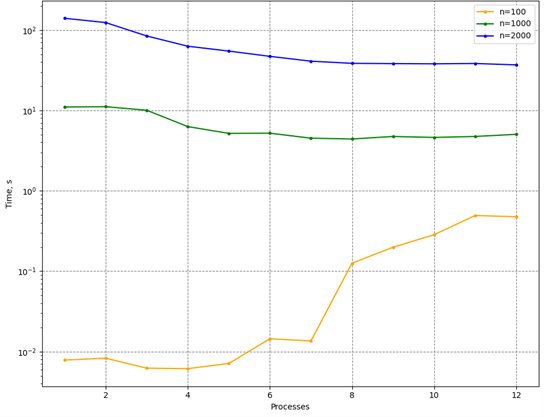
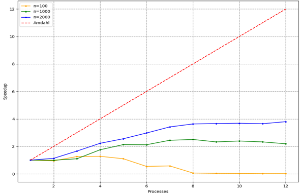

# Задание H (MPI)

Написать программу вычисления матричного выражения:

$A = Tr(BC^3)E+Tr'(B)I$,

где $B,C$ - квадратные плотные матрицы, элементы которых имеют тип **double**, $I$ - единичная матрица, $Tr(M)$ - след матрицы $M$, $Tr'(M)$ - "антислед" матрицы $M$ (сумма элементов антидиагонали). Распараллелить эту программу с помощью MPI. Исследовать зависимость масштабируемости параллельной версии программы от её вычислительной трудоёмкости (размера матриц). Проверить корректность параллельной версии.

Проверка закона Амдала. Построить зависимость *ускорение:число потоков* для заданного примера.

## Требования
- `CMake 3.5+`
- `Какой-либо компилятор C++11`
- `MPI` (`mpiexec` должен быть в окружении)

## Использование
### Конфигурирование
В корне проекта:
```console
usr:~/02.MPI$ mkdir build
usr:~/02.MPI$ cd build
usr:~/02.MPI/build$ cmake ..
```
### Сборка
```console
usr:~/02.MPI/build$ cmake --build .
```
### Запуск примера
```console
usr:~/02.MPI/build$ mpiexec -n 4 ./HPC_02_MPI
```
`-n 4` - кол-во процессов
### Запуск тестов
```console
usr:~/02.MPI/build$ ctest
```
### Запуск бенчмарков
```console
usr:~/02.MPI/build$ ../benchmarks/benchmarks.sh
```
В параметры можно передать путь до `HPC_02_benchmark` (по умолчанию *"./HPC_02_benchmark"*)


## Производительность

Программно-аппаратная конфигурация:

| | |
| --- | --- |
ОС | Ubuntu 22.04.2 LTS |
Число ядер | 6 |
Число потоков |	12 |
Модель процессора |	Intel(R) Xeon(R) E-2136 CPU @ 3.30GHz |
ОЗУ | 64GiB |
Компилятор | g++ (GCC) 10.2.0 |
Реализация MPI | MPICH 4.1.1 |

Зависимость времени работы от числа процессов (*n* - размер матриц):



Зависимость ускорения от числа процессов: 



Ускорение $S(n)=T(1)/T(n)$, где $T(n)$ - время работы алгоритма на $n$ процессорах.

## Структура проекта
```
.
├── README.md - описание проекта (на английском)
├── README.ru.md - описание проекта (на русском)
├── CMakeLists.txt - сценарий сборки CMake
├── results/ - папка с результатами эксперимента
├── main.cpp - точка входа (примеры)
├── include - заголовки
│   └── matrix.h - описание класса матрицы
├── src
│   ├── matrix_base.cpp - основные методы
│   ├── matrix_math.cpp - матричная алгебра
│   ├── matrix_math_parallel.cpp - параллельные методы
│   └── matrix_utils.cpp - вспомогательные методы
├── tests - unit-тесты
│   └── test.cpp
└── benchmarks - бенчмарки
    ├── benchmark.cpp
    └── benchmarks.sh - скрипт для запуска
```
